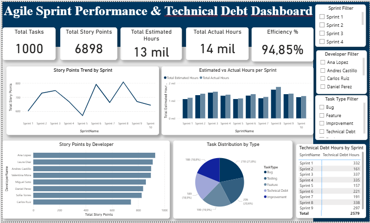

# **Agile Sprint Performance & Technical Debt Dashboard**

## **Descripción del proyecto**

Este proyecto consiste en el desarrollo de un dashboard interactivo en Power BI enfocado en el análisis del desempeño de un equipo de desarrollo bajo metodología Agile (Scrum).

El objetivo es transformar datos operativos de sprints en información estratégica que permita evaluar productividad, eficiencia y acumulación de deuda técnica.

El dataset utilizado simula más de 1.000 registros de tareas distribuidas en múltiples sprints, replicando un entorno real de trabajo en desarrollo de software.

## **Objetivo del análisis**

En equipos de desarrollo es común enfrentar desafíos como:

Subestimación de tiempos

Sobrecarga de trabajo en determinados miembros del equipo

Acumulación de deuda técnica

Desviaciones entre horas estimadas y horas reales

Disminución progresiva de la eficiencia del equipo

Este dashboard permite:

° Analizar la velocidad de entrega por sprint

° Identificar acumulación de deuda técnica

° Comparar horas estimadas vs horas reales

° Evaluar desempeño por miembro del equipo

° Detectar tareas que superan el presupuesto de tiempo

° Apoyar la toma de decisiones basada en datos

## **Métricas desarrolladas**

Total de tareas

Horas reales trabajadas

Horas asociadas a deuda técnica

Porcentaje de deuda técnica

Story Points entregados por sprint

Análisis de tareas fuera de estimación

Distribución de carga de trabajo

